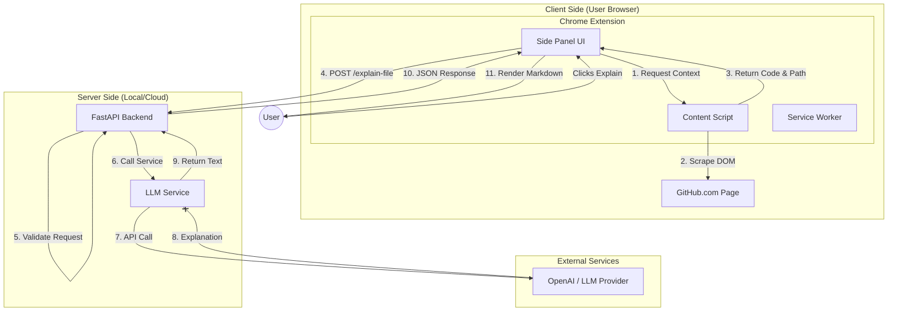

# ExplainMyStack - System Architecture

This document provides a high-level overview of the ExplainMyStack architecture, illustrating how the Chrome Extension interacts with the Backend and External Services.

## High-Level System Architecture

## Component Breakdown

### 1. Chrome Extension (The Frontend)
*   **Side Panel (`sidepanel.html`, `sidepanel.js`)**: The main interface. It holds the state of the application and handles user interactions. It is responsible for communicating with the backend and rendering the Markdown response.
*   **Content Script (`content.js`)**: The bridge between the specific GitHub page and the extension. It has direct access to the DOM to scrape the file content, repository name, and file path. It is triggered only when requested by the side panel to minimize performance impact.
*   **Service Worker (`background.js`)**: Manages the extension's lifecycle and enables the side panel to open when the extension icon is clicked.

### 2. FastAPI Backend (The Brain)
*   **Main Application (`main.py`)**: The entry point. It sets up the HTTP server, handles CORS (Cross-Origin Resource Sharing) to allow requests from the browser extension, and routes requests to the appropriate handlers.
*   **LLM Service (`llm_service.py`)**: Encapsulates the business logic for generating explanations.
    *   **Prompt Engineering**: Constructs a sophisticated prompt to guide the AI to act as a "Senior Engineer".
    *   **Mock Mode**: A fallback mechanism that provides instant, static responses for testing/demo purposes when no API key is configured.
    *   **Client Abstraction**: Manages the connection to the LLM provider (OpenAI).

### 3. Data Flow
1.  **Extraction**: The extension extracts raw text from the DOM.
2.  **Transport**: JSON data is sent over HTTP to the backend.
3.  **Processing**: The backend constructs a context-aware prompt.
4.  **Generation**: The LLM generates the explanation.
5.  **rendering**: The extension renders the returned Markdown for the user.
