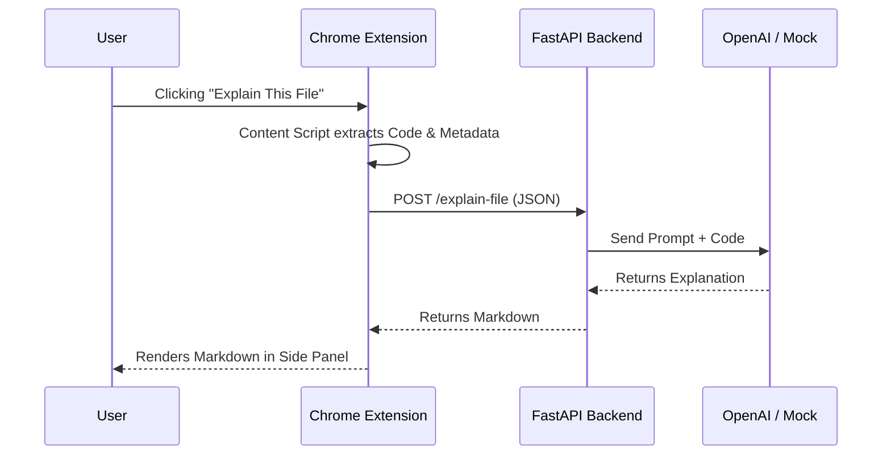

# ExplainMyStack - Design Document

## Architecture Overview

The system consists of two main components: a **Chrome Extension** (Client) and a **FastAPI Server** (Backend).

## detailed Design

### 1. Chrome Extension (Manifest V3)
-   **Manifest**: Defines permissions (`sidePanel`, `activeTab`, `scripting`) and host permissions (`github.com`).
-   **Side Panel (`sidepanel.html`, `sidepanel.js`)**:
    -   Serves as the main UI.
    -   communicate with the Content Script to get data.
    -   Communicates with the Backend to get explanations.
    -   Uses `marked.js` to render Markdown.
-   **Content Script (`content.js`)**:
    -    injected into GitHub pages.
    -   Listens for messages from the Side Panel.
    -   Parses the DOM to find file paths and code content (handling raw views and blob views).
-   **Background Service Worker (`background.js`)**:
    -   Configures the side panel to open on action click.

### 2. Backend (FastAPI)
-   **API Endpoint**: 
    -   `POST /explain-file`: Accepts `FileExplanationRequest`.
-   **Data Models (Pydantic)**:
    -   `FileExplanationRequest`: `repo_name`, `file_path`, `code_content`.
    -   `FileExplanationResponse`: `explanation` (string).
-   **LLM Service (`llm_service.py`)**:
    -   Constructs a "Senior Engineer" persona prompt.
    -   Integration with OpenAI API.
    -   **Mock Mode**: Returns a static, structured response if no API key is present (for easy testing/demo).

## Prompt Strategy
The LLM is prompted to act as a senior engineer onboarding a new developer.
**Structure**:
1.  **What this file does**: High-level summary.
2.  **Why it exists**: Architectural purpose.
3.  **Key Dependencies**: Interactions with other parts.
4.  **Potential Risks**: What could break.

## Security & Scalability
-   **CORS**: Currently allows `*` for local development. In production, restrict to the Extension ID.
-   **API Key**: Backend currently reads `OPENAI_API_KEY` from environment.
